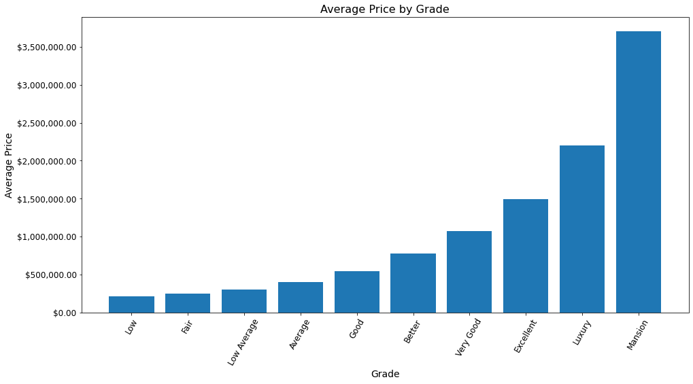

# Real Estate Modeling Project
**Author:** Kai Uechi

## Overview
This project uses linear regression to investigate how features of a home affect its price. Although the final model does not provide particularly accurate prediction, it shows that living area, house condition, and house grade have a large impact on price. By combining this insight with information on the cost of renovating, a real estate investment firm could identify the most profitable investment opportunities.

## Business Problem
A real estate investment firm needs to decide how best to utilize funds when improving existing properties. By analyzing the effect that various features and ammenities have on the price of a property, the firm can ensure it uses its resources efficiently. Using linear regression, I can model for inference to discover what factors increase price the most.

## Data Understanding
The dataset used contains information regarding house sales in King County. 
The columns included are as follows:

* `id` - Serves as a unique identifier for a given house
* `date` - The date the house was sold
* `price` - Sale price of house
* `bedrooms` - Number of bedrooms
* `bathrooms` - Number of bathrooms
* `sqft_living` - Total square footage of living space in the house
* `sqft_lot` - Total square footage of the lot
* `floors` - Number of floors in the house
* `waterfront` - If the house is or is not on a waterfront
* `view` - Category describing the quality of the view from a house
    * (Details as to which categories correspond to what sorts of landmarks/environments is unavailable)
* `condition` - Describes the maintenance condition of a house
    * Poor - Very worn out, likely requiring major reconstruction
    * Fair - Significantly worn, many items require overhauling
    * Average - All major components functioning, some minor repairs needed
    * Good - No obvious maintenance required, althrough not everything is new
    * Very Good - All items well maintained, recent overhaul/repair
* `grade` - Describes the construction and design quality of a house
    * Poor - This grade and below are properties below minimum standards
    * Low - Old, low quality construction. Does not meet code.
    * Fair - Small and simple, with low construction costs. Does not meet code.
    * Low Average - Lowest grade that meets building code, utilizing low quality materials
    * Average - Construction and design is standard
    * Good - Better materials used compared to average
    * Better - Extra exterior and interior design, better architectural design
    * Very Good - High quality features, tend to have larger square footage
    * Excellent - Custom design, higher quality finish work
    * Luxury - Superior build quality, all conveniences present
    * Mansion - Custom designed and built, very large with extrodinary finish work
* `sqft_above` - Square footage of the house, not including the basement 
* `sqft_basement` - Square footage of the basement, if present
* `yr_built` - Year house was constructed
* `yr_renovated` - Year of most recent renovation
* `zipcode` - Postal ZIP code
* `lat` - Latitude coordinate for the property
* `long` - Longitude coordinate for the property
* `sqft_living15` - Total square footage of living space for nearest 15 neighbors
* `sqft_lot15` - Total square footage of the lot for nearest 15 neighbors

## Modeling
Modeling steps are as follows:
* Create simple baseline model
* Create improved model
    * Compare effectiveness of preprocessing methods
* Solve multicollinearity
* Create final model

## Regression Results

* **R-squared** - The final model has an R-squared value of 0.57, meaning that 57% of the variance in price is explained by the model.
* **Mean Squared Error** - The mean squared error of the final model is 34.7, meaning an average error of 34.7% above or below the predicted value.
* **Coefficients** - The two features with the largest effect on price are `condition` and `grade`.
    * These coefficients represent percentage increase or decreases from the intercept, which equals 475,806.26
    * The `condition_Poor` feature is not statistically significant, and the resulting coefficient should not be considered accurate. (This feature is kept in the model to prevent `condition_Poor` and `conditon_Average` from being reduced to a single category)
    
Due to the moderate R-squared value and significant mean squared error, the model is not particularly suited to prediction.


## Conclusions
The following features are noted as having a particularly significant effect on price:
* **House Condition**
* **House Grade**
* **Living Space**

These three features warrant further investigation, such as identifying the cost to improve these features. With that data, it would be possible to determine the most profitable investment methods.

### Impact of House Condition

Improving house condition affects the price significantly: a 9.3% increase from Average to Good, and 26.9% increase from Average to Very Good.

Note that the due to limitations of the model, the listed effect for a "Poor" condition should not be considered reliable.


### Impact of House Grade
Improving grade has a signficant impact on the price of a house: A grade rating of Average results in a 45.3% decrease in price compared to Very Good.


### Impact of Living Space
Increasing living area steadily increases price: Each additional square foot of living space increases price by 0.02%


### Next steps
* Additional data - More data will improve model accuracy.
    * Additional features - Given a dataset with more available features, it may be possible to gain additional insight into the effect of house features on house price.
* Understand cost - By comparing the effect of a feature to the cost of investment, it would be possible to determine what types of renovations are most profitable.


## For More Information
***
Review the [analysis notebook](./real-estate-modeling.ipynb) or the [presentation pdf](./real-estate-modeling_ProjectPresentation.pdf) for more information.

For any additional questions, please contact **Kai Uechi (kaiuechi@gmail.com)**

## Repository Structure
***

    ├── code
    │   └── draft.ipynb  -An unorganized, experimental notebook from earlier in the project
    ├── data  -Contains the dataset as a .csv file, and a .md file explaining the columns
    ├── images  -Contains images used in README
    ├── README.md  -Overview of analysis and repo contents
    ├── real-estate-modeling_ProjectPresentation.pdf  -A slide deck for presenting this project
    └── real-estate-modeling.ipynb  -The final notebook for this project.


```python

```
